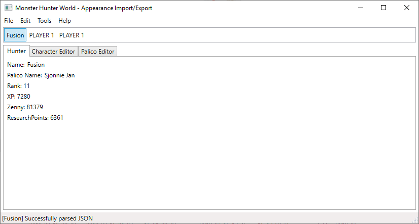
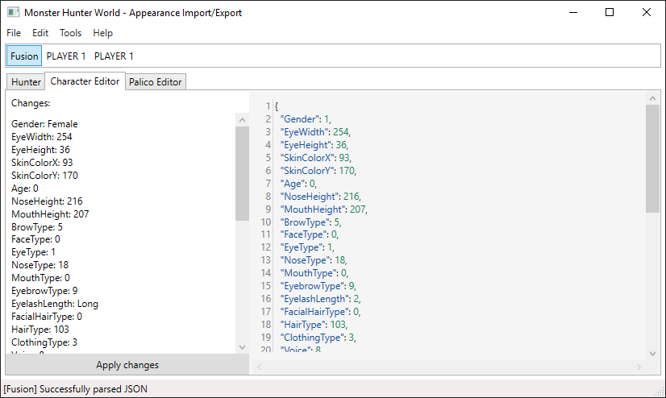
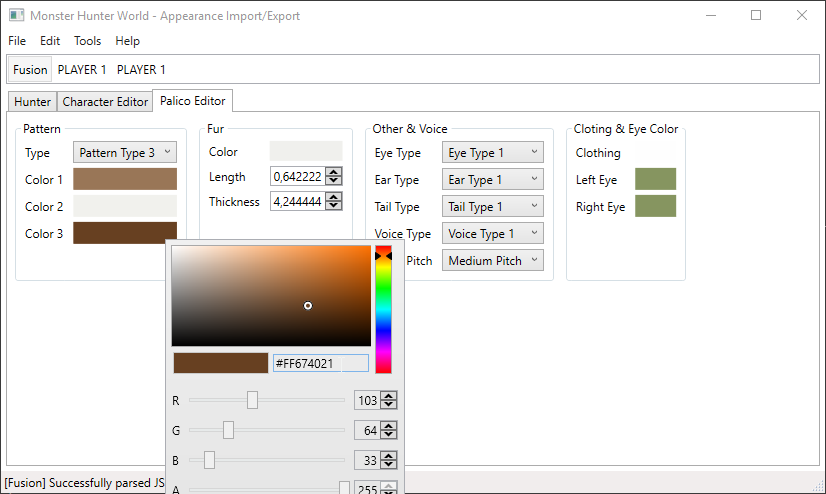
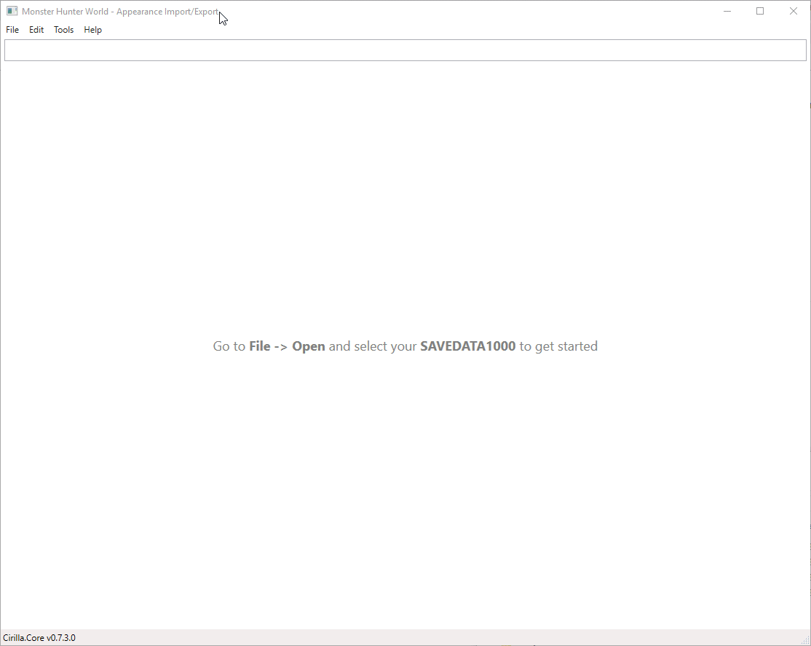

# Table of Contents

* [Introduction](#introduction)
* [Hunter tab](#hunter-tab)
* [Character Editor tab](#character-editor-tab)
* [Palico tab](#palico-tab)
* [Copy appearance from one character to another](#copy-appearance-from-one-character-to-another)
* [What is JSON](#what-is-json)
* [Will I get banned for using this tool?](#will-i-get-banned-for-using-this-tool)
* [Can I use this to unlock DLC cosmetics](#can-i-use-this-to-unlock-dlc-cosmetics)


# Introduction

This tool allows you to import/export character appearances as JSON files or Character Presets (.cmp)

Open your save by going to `File -> Open` and clicking on the `SAVEDATA1000` file.  
It is advised to make a copy (backup) of your SaveData before changing anything with this tool.
When the tool finishes loading your SaveData you can select your hunter from the list to start editing.

You can't edit hunters named `PLAYER 1` since those are unused slots (well, you could edit them, but the game won't let you select that saveslot).


## Hunter tab



In this tab you can click on your hunter's name and start typing to change it.  
You can change your palico's name in the same way, by clicking on it or selecting it.


## Character Editor tab



In this screen you can edit you character's appearance. This screen is divided in two panels.

The left panel show the changes that you've made in the right panel, and it applies these changes to your character when you click on the `Apply changes` button.
You still need to save your SaveData by going to `File -> Save as`.

The right panel shows a [JSON representation](#what-is-json) of your character.  
You can make changes here (eg. [change gender](#what-is-json)) or copy the whole text and paste it in the text field of another character to import it there.

You can always reset the text field to your current appearance by clicking on `Edit -> Fill editor with current appearance`, this will clear the text field and then fill it with your current appearance.

At the moment there is no list of valid values (eg. NoseTypes, BrowTypes, etc).
This also means that the editor does not check if the values you have entered are valid, however the game will reset them to the default ones if they are not valid (which is nice, because otherwise it might crash).

You can remove any JSON key-value pair. The importer will then ignore/not change those values.  
You can use comments `// single line comment` or `/* multi line comment */`


## Palico tab



Not much explanation needed here. Just select a value in a dropdown box and click on a color to change it.
Inside the color picker you can click on the hex code to copy/paste it.


## Copy appearance from one character to another

The main reason to use this tool is when you want to change your characters appearance (wow).  
The easiest way to do this is to copy the appearance from another character and overwrite your existing character with this appearance.
The method described below assumes that you have two saveslots.

- In the first saveslot you have your main character (whose appearance you want to change).  
- In the second slot you have a character whose appearance you want to have. You get this second saveslot by starting a new game and using the ingame character creator.

You can speed up the character creation process by skipping the intro video using [UberGrainy's Skip Opening Cutscene Mod](https://www.nexusmods.com/monsterhunterworld/mods/374).  
When you have these two saveslots you can continue with the steps below, which will overwrite your main character's appearance with the newly created character's appearance.  



1. Open your save
2. Select the source character, the character whose appearance you want to have
3. Go to the character editor tab (on the source character)
4. Right-click in the text field and click `Copy everything` (you can also Ctrl-A and Ctrl-C)
5. Select the target character, the character whose appearance you want to overwrite
6. Right-click in the text field and click on `Clear textfield`
7. Right-click and click `Paste` (or Ctrl-V)
8. You can see the changes in the left panel (old value is red, new value is green)
9. Click on `Apply changes` to apply the changes
10. Click on `File -> Save as` to save your changes

In the video you can see that I have multiple SAVEDATA1000 files, that is because I made a few backups. The game only loads `SAVEDATA1000`.


## What is JSON

> JSON is short for JavaScript Object Notation, and is a way to store information in an organized, easy-to-access manner. In a nutshell, it gives us a human-readable collection of data that we can access in a really logical manner.

As a simple example, my character's appearance might be written in JSON as follows:

```json
{
  "Gender": 1,
  "BrowType": 5,
  "FaceType": 0,
  "EyeType": 1,
  "NoseType": 18,
  "MouthType": 0,
  "EyebrowType": 9,
  "EyelashLength": 2,
}
```

Inside the object, we can declare any number of properties using a "name": "value" pairing, separated by commas.

### Example

We can see that the `Gender` property has the value `1`, this means that the character is female. A male character would have the value `0`.
This means that we can change our characters gender from female to male by replacing `"Gender" : 1,` with `"Gender": 0,` (make sure NOT to remove the comma, because those are needed to separate properties).

[This explanation is based on copterlabs' "JSON: What It Is, How It Works, & How to Use It"](https://www.copterlabs.com/json-what-it-is-how-it-works-how-to-use-it/)


## Will I get banned for using this tool?

If they really wanted to then they could probably find out that you changed your character outside of the game, but at the moment there is no indication that they are.

Furthermore:
- Appearance editing has been a thing already for a while (using Cheat Engine)
- Custom models/items also have been a thing for a while
- Inventory/stat editing also has been a thing for a while

There haven't been any bans for the actions mentioned above, in fact there hasn't been a single ban in MHW yet as far as I know (feel free to correct me).


## Can I use this to unlock DLC cosmetics

You **can't** use this tool to unlock cosmetics (hair, facepaint, etc) that you **don't own.**  
While my tool doesn't check for that (in fact it doesn't even check if any values are valid) the game itself validates your character on startup.  
If you were to use a DLC cosmetic (e.g The Admiral) the game would simply reset your hair to de default value (if you don't own the DLC).
